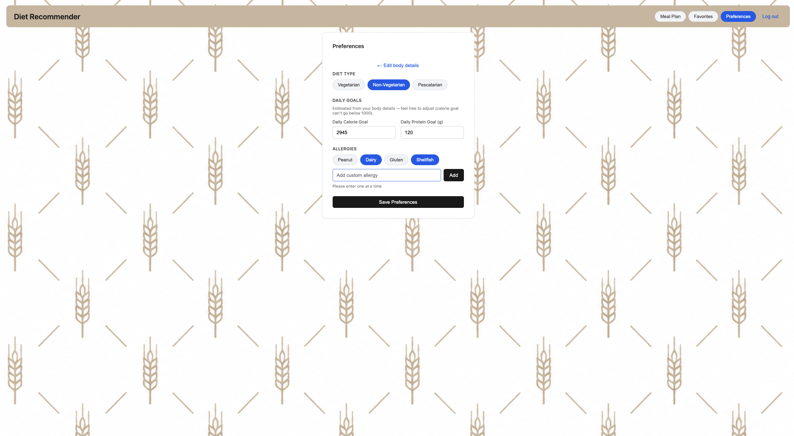
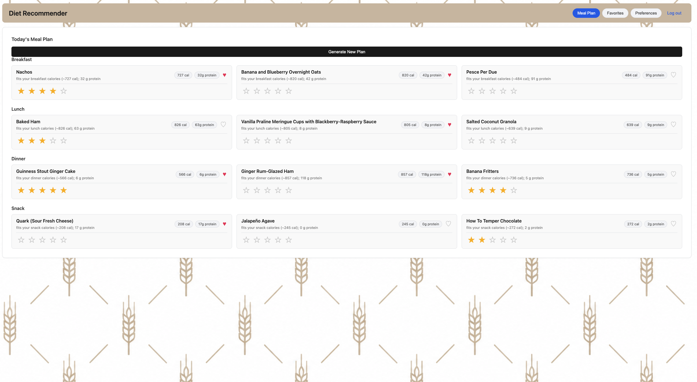

# Diet Recommender

You tell it a few things once — whether you're vegetarian, non-vegetarian or pescatarian, what you're allergic to, and your daily calorie and protein targets — and it hands back a full balanced day of meals: breakfast, lunch, dinner and a snack. Every meal explains *why* it's there, opens into a real recipe you can cook, and the more you rate what you like, the more the suggestions lean toward your taste.

---

## What it does

- **Accounts** — sign up, log in, log out. Your preferences and history are saved and waiting next time.
- **Preferences** — set your diet (vegetarian / non-vegetarian / pescatarian), list your allergies, and enter daily calorie and protein targets.
- **A day of meals** — one tap gives you breakfast, lunch, dinner and a snack that respect your diet, avoid your allergens, and add up to your targets.
- **Reasons you can trust** — each meal says why it was picked ("fits your lunch calories, adds 32 g protein, shares lentils with dishes you rated well").
- **Real recipes** — tap any meal for its ingredients and directions, so you can actually make it.
- **Learns your taste** — rate meals you enjoy and future plans drift toward the food you like.
- **Saved meals** — save favourites so you can find them again without hunting.

---

## Screenshots

### Getting in
| Sign up | Log in |
|---|---|
|  |  |

### Setting preferences
| Body details | Diet, goals & allergies |
|---|---|
|  |  |

### Using it
| Meal plan | Favourites |
|---|---|
|  |  |

---

## How it works

Three containers, each doing one job, wired together on a private Docker network and brought up with a single command:

| Container | Stack | Responsibility |
|-----------|-------|----------------|
| **frontend** | React 19 + Vite | Everything you see and click. Calls the API and renders the result. |
| **backend**  | FastAPI (Python 3.12) | Accounts, data, and the recommendation engine — all the actual work. |
| **db**       | PostgreSQL 17 |  Every user's accounts, preferences, ratings and saved meals.  |

The recommendation engine is **content-based**: it turns each recipe into a TF-IDF vector of its ingredients and tags, learns a "taste vector" from the recipes you've rated, and ranks candidates by cosine similarity — but only after filtering out anything that breaks a rule (wrong diet, contains an allergen, wrong calorie range). Allergy categories such as dairy or gluten are expanded to the ingredient words recipes actually use, and drinks are left out of meal plans by default. Content-based rather than collaborative because it works from your very first rating, with no need for a crowd of other users first.

The engine and its data are built into memory once when the backend boots; every request after that is served without touching the database on the hot path. The full reasoning — TF-IDF, the taste vector, cosine similarity, the meal-plan assembly — is written up in [`docs/ml_logic.md`](docs/ml_logic.md).

---

## Getting started

The whole point of the setup is that there isn't much of one. If you have Docker, you have everything.

### Prerequisites

- **Docker Engine** 20.10+ and **Docker Compose v2** (the `docker compose` subcommand — bundled with Docker Desktop, or the `docker-compose-plugin` on Linux).
- Roughly 1 GB of free disk for the the recipe dataset.
- Ports **5173**, **8000** and **5432** free on your machine.

No local Python, Node or PostgreSQL needed — it all runs inside the containers.

### Run it

```bash
git clone https://github.com/Tejas1305/13_Tejas.D-diet-recommender.git
cd 13_Tejas.D-diet-recommender
docker compose up
```

The first run builds the images and starts all three services. The backend is set to wait until PostgreSQL reports healthy before it starts, so you don't have to worry about start-up order — Compose handles it.

Once it's up:

| What | Where |
|------|-------|
| Web app | http://localhost:5173 |
| API | http://localhost:8000 |
| Interactive API docs (Swagger) | http://localhost:8000/docs |
| Health check | http://localhost:8000/health |

### Check it's running

```bash
curl http://localhost:8000/health
# {"api":"ok","db":"up"}
```

`"db":"up"` confirms the backend can reach the database. If you see that, everything is wired correctly.

### Configuration (optional)

It runs out of the box with sensible defaults — **no `.env` file is required**. To override the defaults, copy the example and edit it:

```bash
cp .env.example .env
```

```dotenv
POSTGRES_USER=diet
POSTGRES_PASSWORD=diet
POSTGRES_DB=diet
JWT_SECRET=change-me-to-a-long-random-string
```

In any real deployment you'd set a strong `JWT_SECRET`; the built-in default exists only so the project runs with zero configuration.

### Stopping and resetting

```bash
docker compose down      # stop and remove the containers
docker compose down -v   # also wipe the database volume for a clean slate
```

---

## Project structure

```
.
├── backend/                 # FastAPI service
│   ├── app/
│   │   ├── main.py          # app entry, health check, router wiring
│   │   ├── db.py            # SQLAlchemy engine + session
│   │   ├── models.py        # database tables
│   │   ├── schemas.py       # request/response shapes
│   │   ├── auth.py          # password hashing + JWT
│   │   ├── recommender.py   # the recommendation engine
│   │   └── api/v1/          # versioned API routes
│   ├── Dockerfile
│   └── requirements.txt
├── frontend/                # React + Vite single-page app
│   ├── src/                 # components (App, Login, Signup) + api client
│   └── Dockerfile
├── docs/                    # design documentation (read these)
├── notebooks/               # recommendation-engine development notebook
├── seed/                    # recipe dataset loaded into memory at startup
├── docker-compose.yaml      # the three services, wired together
└── .env.example
```

---

## The dataset

Recipes come from **Epicurious — Recipes with Rating and Nutrition** ([Kaggle: `hugodarwood/epirecipes`](https://www.kaggle.com/datasets/hugodarwood/epirecipes)), roughly 20,000 recipes with titles, ingredient lines, directions, category tags and nutrition. The file ships inside the repo under seed/, so there's nothing to download at runtime — on startup the backend reads it into memory and builds the recommendation vectors. Nothing is imported into PostgreSQL; the database holds only user data. That is what keeps the whole thing plug-and-play.

---

## Known limitations

- **Allergen and diet matching is keyword-based.** Categories are expanded to the ingredient words recipes use, but a small number of composite ingredients — Worcestershire sauce, dashi — contain animal or allergen products without naming them, so they can slip through. A production system would use a trained classifier.
- **Drinks are excluded by default** with no option yet to include them.
- **No vegan diet type yet.** Vegetarian allows eggs and dairy; users avoiding those can add them as allergies for now.
- **Authentication uses a single access token** with no refresh-token rotation.
- **The frontend container runs the Vite development server.** A production build would serve static files behind a small web server and ship a much smaller image.

---

## Design documentation

The thinking behind each part lives in [`docs/`](docs/):

- [`system_architechture.md`](docs/system_architechture.md) — the three services and how a request flows through them
- [`user_stories.md`](docs/user_stories.md) — who it's for and what they want to do
- [`api_design.md`](docs/api_design.md) — the endpoints
- [`database_schema.md`](docs/database_schema.md) — the tables and how they connect
- [`ml_logic.md`](docs/ml_logic.md) — the recommendation engine, derived from first principles

---

## AI assistance Declaration

This project was built with the help of an AI coding assistant (Gemini, Claude), used the way a developer uses any modern tool — to move faster on implementation while the design decisions and their trade-offs stayed with me.

I own the architecture and the engineering choices:recommendation system, classifying diet from ingredients rather than the dataset's unreliable tags, holding the recipe catalogue in memory rather than querying it per request, and the allergen and drink handling added after testing against the real data. 

Approximate share of AI assistance by area:

| Area | Used For | AI assistance |
|---|---|---|
| Frontend | UI components, styling, layout | ~70% |
| Backend | Implementation and boilerplate; design and logic my own | ~30% |
| Docker / infrastructure | AI Not Used | ~0% |

---

## License

Released under the [MIT License](LICENSE).

---

Built by **Tejas Dhawale**.
