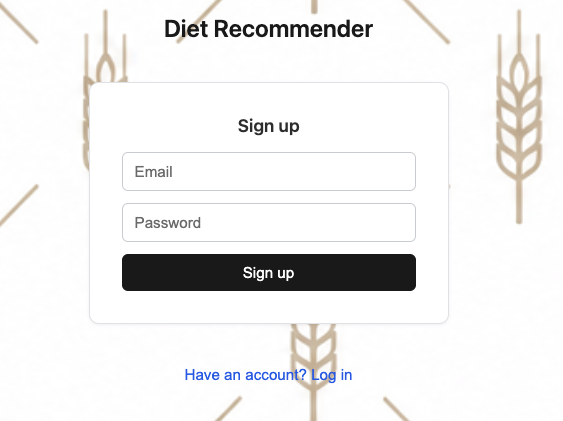
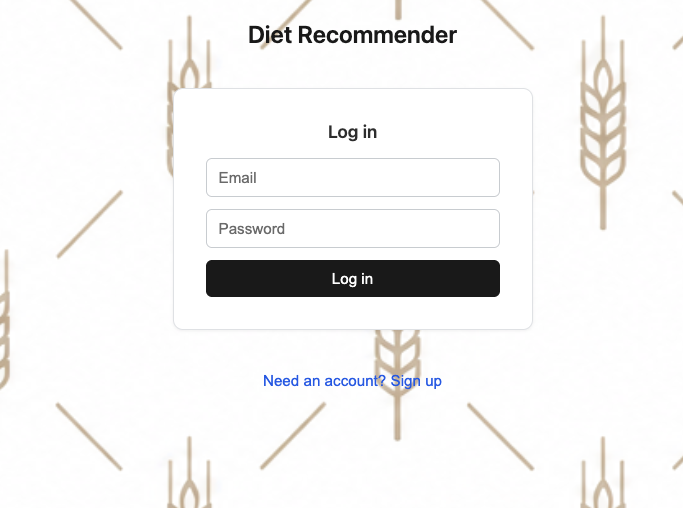
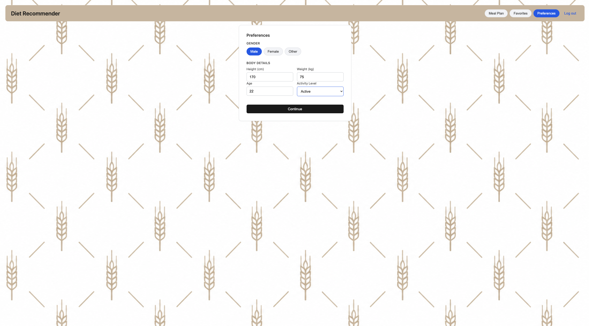
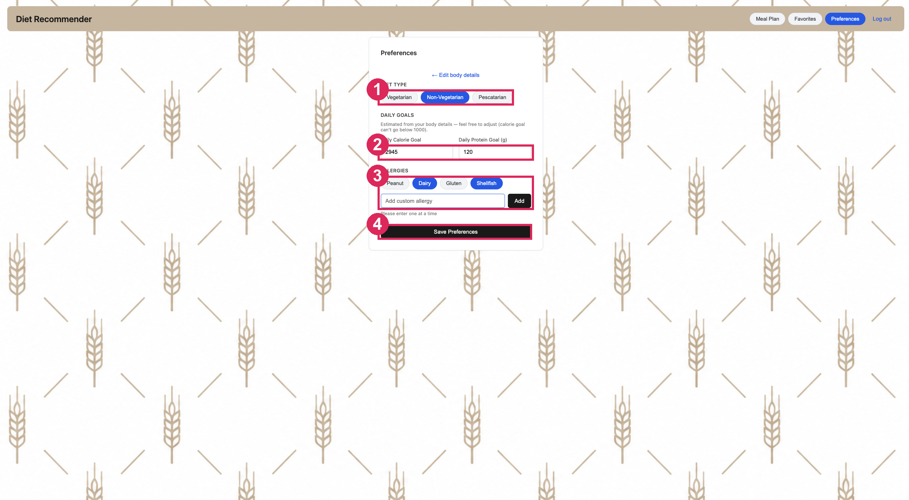
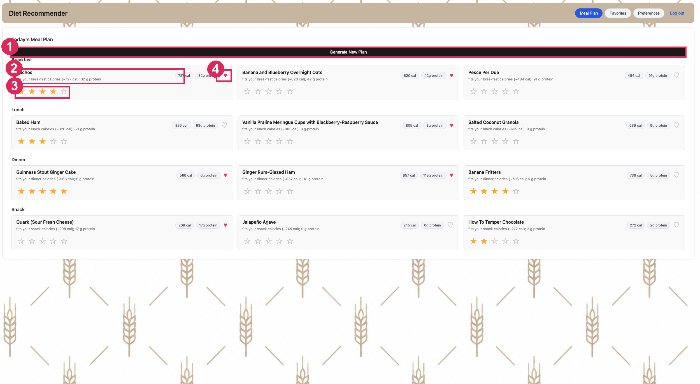
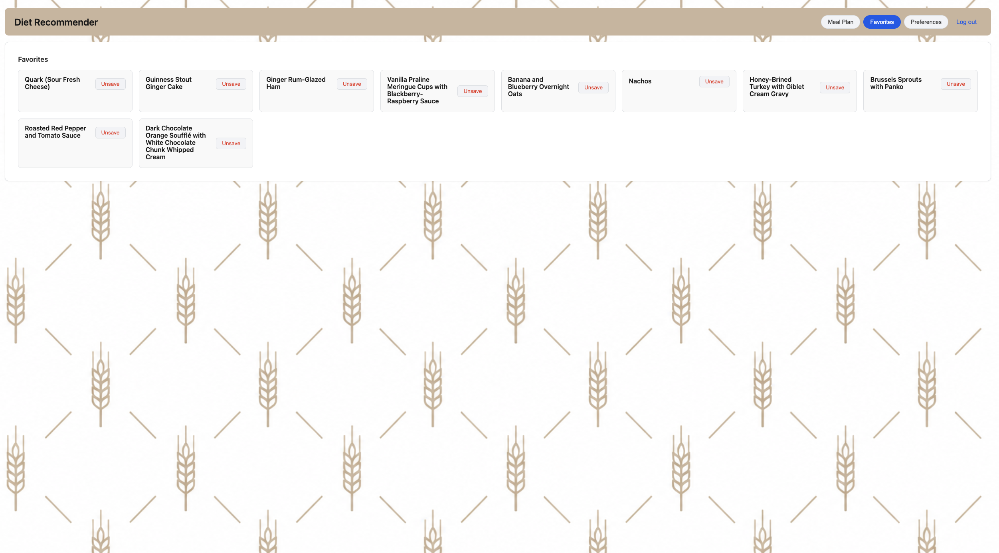

# User Manual

A short walkthrough of how to use the app. If you haven't started it yet, see the [Installation Guide](INSTALLATION.md) first.

## Creating an account

Open the app and click "Need an account? Sign up". Enter your email and a password of at least 8 characters. Once you've signed up, log in with the same email and password.-- User account is important as it allows for the system to cater the recommendations as per your taste.

| Sign up | Log in |
|---|---|
|  |  |

## Setting your preferences

The first time you log in, you set your preferences. This takes two steps.

**Step 1: about you.** Choose your gender and enter your height, weight, age, and activity level, then click Continue. The app uses these to work out sensible daily calorie and protein goals, so you don't have to figure them out yourself.

**Step 2: your food.**

- Pick your diet: vegetarian, non-vegetarian, or pescatarian.
- Look over the calorie and protein goals it filled in. Adjust them if you want.
- Add any allergies. Tap the common ones (peanut, dairy, gluten, shellfish), or type your own and click Add.

Click Save Preferences when you're done. You can change any of this later from the Preferences tab.

**1** diet type · **2** daily calorie and protein goals · **3** allergies · **4** save

## Your meal plan

The Meal Plan page shows a full day of food: breakfast, lunch, dinner, and a snack, with three options for each meal. Every option lists its calories and protein and a short line saying why it was chosen.

From here you can:

- **Open the recipe.** Click a meal to see its ingredients and directions.
- **Rate it.** Give it 1 to 5 stars. Ratings are how the app learns what you like. Meals similar to the ones you rate highly show up more often, and meals you rate 1 or 2 stars stop appearing.
- **Save it.** Click the heart to add a meal to your favourites.
- **Get new options.** Click "Generate New Plan" for a fresh set of meals.

**1** generate a new plan · **2** open the recipe · **3** rate with stars · **4** save to favourites

The very first plan is a set of popular starting picks, because the app doesn't know your taste yet. Rate a few meals and the plans start matching you.

## Favourites

The Favourites tab lists everything you've saved. Click a meal to view its recipe, or click Unsave to take it off the list.

## Logging out

Click "Log out" in the top corner. Your preferences, ratings, and favourites are all saved, so everything is waiting for you the next time you log in.
