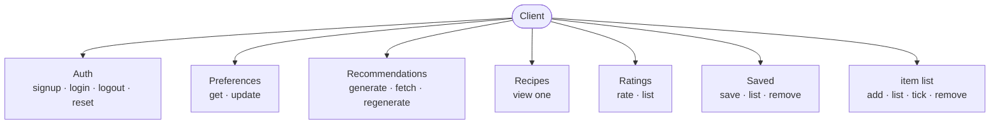
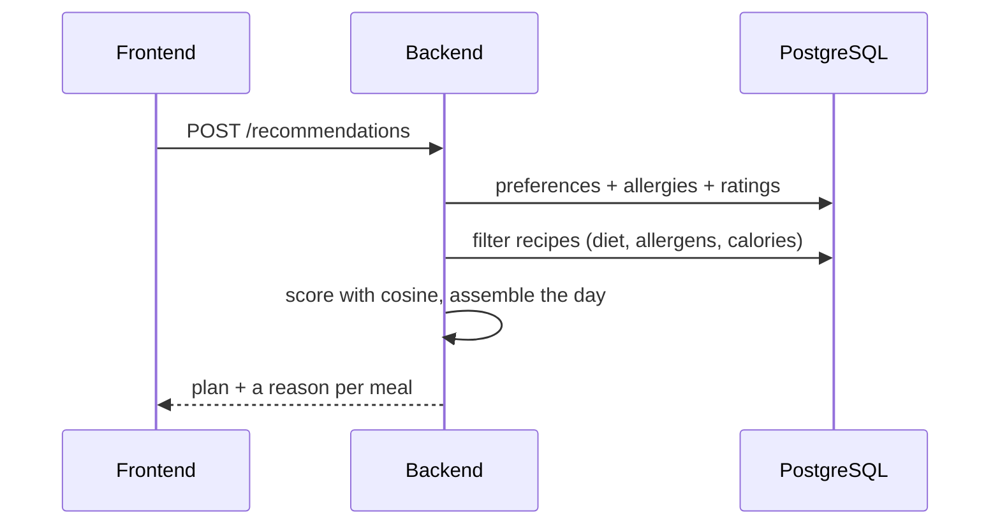

# API Design
 
everything is JSON; everything except sign-up, log-in and the reset endpoints needs a token in the `Authorization` header; and the usual status codes apply (200 ok, 201 created, 400 bad input, 401 not logged in, 404 not found).
 
Split up:
 

 
## Accounts — US-1, 2, 3, 4
 
**`POST /auth/signup`** — in `{ email, password }`, out `201 { user_id }`. Duplicate or bad email → 400.

**`POST /auth/login`** — in `{ email, password }`, out `200 { access_token }`. Wrong credentials → 401.

**`POST /auth/logout`** — out `200`. The client drops its token; the endpoint's here to keep the flow clean.

### Reset Password link will be shown on the screen instead of email to meet the plug and play:

**`POST /auth/password-reset/request`** — in `{ email }`, out `200`. Issues a token; for the demo the link shows up in the logs instead of being emailed.

**`POST /auth/password-reset/confirm`** — in `{ token, new_password }`, out `200`.
 
## Preferences — US-5, 6, 7, 15
 
**`GET /pref`** — out `{ diet_type, daily_cal_goal, daily_prot_goal, allergy: [...] }`.

**`PUT /pref`** — same shape in, updated version out. Used both for first-time onboarding and later edits in settings — it's the same call either way.
 
## Recommendations — US-8, 10, 16
 
**`POST /recommendations`** — the main event. No body needed; it reads the user's preferences and taste and builds a day.
 

 
Expected response would look something like:
```
{
  plan_id,
  meals: [
    {
      slot: "breakfast",
      recipe: { id, title, cal, prot_g },
      explanation: "Pescatarian, fits your breakfast calories, adds 22 g protein, and shares rice with dishes you rated highly."
    },
    ...
  ]
}
``` 
**`GET /recommendations/{plan_id}`** — fetch a plan you already have.

**`POST /recommendations/regenerate`** — fresh plan, same targets, for when today's doesn't appeal.
 
## Recipes — US-9
 
**`GET /recipes/{id}`** — everything the recipe page shows:
```
{ id, title, cal, prot_g, fat, sodium,
  ingredients: ["2 tbsp butter, melted", ...],
  directions,
  tags: ["Vegetarian", "Italian", ...] }
```
 
## Ratings — US-11
 
**`POST /rating`** — in `{ recipe_id, stars }`, out `201`. This is what reshapes taste for the next plan.

**`GET /rating`** — the user's rating history.
 
## Saved recipes — US-14
 
**`POST /saved`** `{ recipe_id }` → 201 · 

**`GET /saved`** → list · 

**`DELETE /saved/{recipe_id}`** → 200.
 
## Item list — US-12, 13
 
**`POST /item-list`** `{ ingredient_text, recipe_id? }` → 201

**`GET /item-list`** → the list

**`PATCH /item-list/{id}`** `{ checked }` → tick or untick

**`DELETE /item-list/{id}`** → remove
 