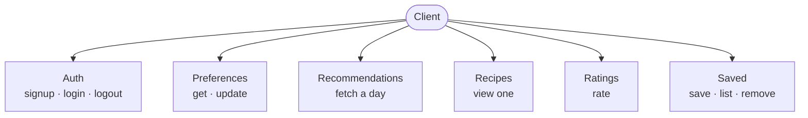
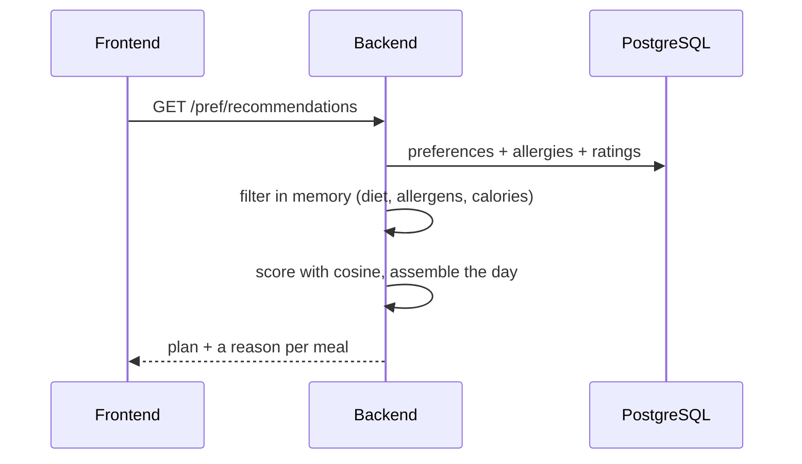

# API Design
 
Everything is under `/api/v1` and returns JSON, except log-in, which takes form-encoded fields for the OAuth2 password flow. Every endpoint except sign-up and log-in needs a bearer token in the `Authorization` header. Usual status codes apply (200 ok, 201 created, 400 bad input, 401 not logged in, 404 not found).

 

 
## Accounts — US-1, 2, 3

**`POST /auth/signup`** — in `{ email, password }`, out `201 { id, email }`. Duplicate or bad email → 400.

**`POST /auth/login`** — form-encoded `username` (the email) and `password`, out `200 { access_token, token_type }`. Wrong credentials → 401.

**`POST /auth/logout`** — out `200 { detail }`. The client drops its token; the endpoint's here to keep the flow clean.
 
## Preferences — US-5, 6, 7, 15
 
**`GET /pref`** — out `{ diet_type, daily_cal_goal, daily_prot_goal, allergies: [...], gender, height, weight, age, activity_level }`.

**`PUT /pref`** — same shape in, updated version out. Used both for first-time onboarding and later edits in settings — it's the same call either way.
 
## Recommendations — US-8, 10, 16
 
**`GET /pref/recommendations`** — the main event. No body; it reads the user's preferences, allergies and ratings and builds a day. Regenerating is just calling it again — there's no separate endpoint, and plans aren't stored, so there's no fetch-by-id. Drinks are excluded from generated plans.
 

 
Response is keyed by slot, with a few options each:
```
{
  meals: {
    breakfast: [
      { slot, recipe_id, title, calories, protein,
        explanation: "fits your breakfast calories (~512 cal); 22 g protein; shares rice with dishes you rated well" },
      ...
    ],
    lunch: [...], dinner: [...], snack: [...]
  },
  cold_start: true
}
```
`cold_start` is true until the user has a usable rating; the explanation drops its taste half until then.
 
## Recipes — US-9
 
**`GET /pref/recipes/{id}`** — what the recipe page shows:
```
{ recipe_id, title, calories, protein,
  ingredients: ["2 tbsp butter, melted", ...],
  directions: [...] }
```
Fat, sodium and tags exist in the engine but aren't returned here.
 
## Ratings — US-11
 
**`POST /pref/rate`** — in `{ recipe_id, rating }` (1–5), out `200 { status, message }`. Upserts, and reshapes taste for the next plan. No rating-history endpoint yet.
 
## Saved recipes — US-14
 
**`POST /pref/favorites`** `{ recipe_id, title }` → 200 the saved item ·

**`GET /pref/favorites`** → list ·

**`DELETE /pref/favorites/{recipe_id}`** → 200.
