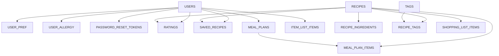

# Database Schema

Every table here earns its place from a user story — nothing speculative. The data is relational (a recipe has many ingredients and tags; a user has many ratings and plans), which is the whole reason it's Postgres and not something document-shaped.

## How the tables connect

A map of the tables by name — arrows point from the table holding the foreign key to the table it references.

The two "hubs" are **USERS** (everything personal hangs off it) and **RECIPES** (everything about food points back to it). **RECIPE_TAGS** and **MEAL_PLAN_ITEMS** are join tables — they each carry two foreign keys and sit between two other tables.

## Keys at a glance

Every table has an integer surrogate primary key called `id`, except the two where a natural key or a one-to-one link makes more sense (called out below). Foreign keys are named `<table>_id` and are indexed.

| Table | Primary key | Foreign keys → referenced table |
|---|---|---|
| users | id | — |
| user_pref | user_id | user_id → users |
| user_allergy | id | user_id → users |
| password_reset_tokens | id | user_id → users |
| recipes | id | — |
| recipe_ingredients | id | recipe_id → recipes |
| tags | id | — |
| recipe_tags | (recipe_id, tag_id) | recipe_id → recipes, tag_id → tags |
| ratings | id | user_id → users, recipe_id → recipes |
| saved_recipes | id | user_id → users, recipe_id → recipes |
| meal_plans | id | user_id → users |
| meal_plan_items | id | meal_plan_id → meal_plans, recipe_id → recipes |
| shopping_list_items | id | user_id → users, recipe_id → recipes (nullable) |

---

## Recipe catalogue (loaded from the dataset)

### recipes
The core food table.

| Column | Type | Key / notes |
|---|---|---|
| id | serial | **PK** |
| title | text | |
| cal | numeric | used for nutrition filtering |
| prot | numeric | used for the protein target |
| fat | numeric | stored for completeness |
| sodium | numeric | stored for completeness |
| source_rating | numeric | the dataset's own score — orders things sensibly before a user has rated anything |
| directions | text | the steps, shown on the recipe page |
| image_url | text | nullable; usually empty, which is fine |

### recipe_ingredients
The ingredient lines.

| Column | Type | Key / notes |
|---|---|---|
| id | serial | **PK** |
| recipe_id | int | **FK → recipes.id**, on delete cascade |
| ingredient_text | text | the raw line, e.g. *"2 tbsp butter, melted"* — kept as-is for display and the shopping list |
| disp_order | int | preserves the original order |

> Ingredients stay as free text instead of getting their own normalized table. That's deliberate — turning every ingredient into a tidy master list is a rabbit hole and isn't needed. The model tokenizes these lines, and allergy filtering matches keywords against them.

### tags

| Column | Type | Key / notes |
|---|---|---|
| id | serial | **PK** |
| name | text | e.g. *Vegetarian*, *Italian*, *Main Course* |
| type | text | dietary / cuisine / course / allergen_free / other |

### recipe_tags
Join table — many recipes to many tags.

| Column | Type | Key / notes |
|---|---|---|
| recipe_id | int | **FK → recipes.id**, part of **composite PK** |
| tag_id | int | **FK → tags.id**, part of **composite PK** |

*The primary key is the pair `(recipe_id, tag_id)`, so the same tag can't be attached to the same recipe twice.*

---

## Accounts

### users

| Column | Type | Key / notes |
|---|---|---|
| id | serial | **PK** |
| email | text | unique, not null |
| password_hash | text | never the plain password |
| created_at | timestamp | |

### user_preferences
One row per user, so the user id *is* the primary key (a one-to-one link).

| Column | Type | Key / notes |
|---|---|---|
| user_id | int | **PK and FK → users.id**, on delete cascade |
| diet_type | text | vegetarian / non_vegetarian / pescatarian |
| daily_cal_goal | numeric | |
| daily_prot_goal | numeric | |
| height | numeric | nullable — only if auto-calculate is used |
| weight | numeric | nullable |
| age | int | nullable |
| activity_level | text | nullable |

### user_allergy

| Column | Type | Key / notes |
|---|---|---|
| id | serial | **PK** |
| user_id | int | **FK → users.id**, on delete cascade |
| allergy | text | a keyword like *peanut*, used to exclude recipes |

### password_reset_tokens

| Column | Type | Key / notes |
|---|---|---|
| id | serial | **PK** |
| user_id | int | **FK → users.id**, on delete cascade |
| token | text | unique |
| expires_at | timestamp | |
| used | boolean | so a token works once and only once |

---

## What drives personalisation

### ratings
The fuel for the recommendation engine — the user's taste is learned straight from these rows.

| Column | Type | Key / notes |
|---|---|---|
| id | serial | **PK** |
| user_id | int | **FK → users.id**, on delete cascade |
| recipe_id | int | **FK → recipes.id** |
| stars | int | 1–5 |
| created_at | timestamp | |

*A unique constraint on `(user_id, recipe_id)` keeps one rating per user per recipe — re-rating updates the existing row.*

### saved_recipes

| Column | Type | Key / notes |
|---|---|---|
| id | serial | **PK** |
| user_id | int | **FK → users.id**, on delete cascade |
| recipe_id | int | **FK → recipes.id** |
| saved_at | timestamp | |

*Unique on `(user_id, recipe_id)` — a recipe can't be saved twice.*

---

## Plans and shopping

### meal_plans

| Column | Type | Key / notes |
|---|---|---|
| id | serial | **PK** |
| user_id | int | **FK → users.id**, on delete cascade |
| created_at | timestamp | |
| target_cal | numeric | snapshot of the target this plan was built for |
| target_prot | numeric | snapshot |

### meal_plan_items

| Column | Type | Key / notes |
|---|---|---|
| id | serial | **PK** |
| meal_plan_id | int | **FK → meal_plans.id**, on delete cascade |
| recipe_id | int | **FK → recipes.id** |
| meal_slot | text | breakfast / lunch / dinner / snack |
| planned_cal | numeric | this meal's share of the day |

### shopping_list_items

| Column | Type | Key / notes |
|---|---|---|
| id | serial | **PK** |
| user_id | int | **FK → users.id**, on delete cascade |
| ingredient_text | text | the line the user added |
| recipe_id | int | **FK → recipes.id**, nullable — which recipe it came from, if any |
| checked | boolean | ticked off when bought |
| added_at | timestamp | |

---
