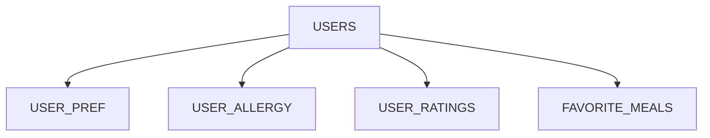

# Database Schema

Postgres holds only per-user data — accounts, preferences, allergies, ratings and saved meals. The recipe catalogue isn't in the database: it's loaded from a JSON file into memory at startup (see [ml_logic.md](ml_logic.md)). So the `recipe_id` columns below are plain integers pointing into that in-memory catalogue, not foreign keys, and there's no recipes/tags/ingredients table to join to. Generated meal plans aren't stored either — they're built on each request and returned.

## How the tables connect

Everything hangs off **users**. Arrows point from the table holding the foreign key to the one it references.

## Keys at a glance

Each table has an integer `id` primary key, except `user_pref`, which is one row per user and uses `user_id` as its key. Every `user_id` foreign key cascades on delete. `recipe_id` (in `user_ratings` and `favorite_meals`) is **not** a foreign key — nothing in the database backs it.

| Table | Primary key | Foreign keys |
|---|---|---|
| users | id | — |
| user_pref | user_id | user_id → users |
| user_allergy | id | user_id → users |
| user_ratings | id | user_id → users |
| favorite_meals | id | user_id → users |

---

## Accounts

### users

| Column | Type | Key / notes |
|---|---|---|
| id | serial | **PK** |
| email | text | unique, not null |
| hashed_password | text | never the plain password |
| created_at | timestamptz | defaults to now |

### user_pref
One row per user, so `user_id` *is* the primary key (a one-to-one link).

| Column | Type | Key / notes |
|---|---|---|
| user_id | int | **PK and FK → users.id**, on delete cascade |
| diet_type | text | vegetarian / non_vegetarian / pescatarian |
| daily_cal_goal | float | |
| daily_prot_goal | float | |
| gender | text | nullable |
| height | float | nullable — body details, used to estimate goals |
| weight | float | nullable |
| age | int | nullable |
| activity_level | text | nullable |

### user_allergy

| Column | Type | Key / notes |
|---|---|---|
| id | serial | **PK** |
| user_id | int | **FK → users.id**, on delete cascade |
| allergy | text | a category (dairy, gluten, …) or a custom word; expanded to ingredient terms when filtering |

---

## Personalisation

### user_ratings
The fuel for the recommendation engine — the user's taste is learned from these rows.

| Column | Type | Key / notes |
|---|---|---|
| id | serial | **PK** |
| user_id | int | **FK → users.id**, on delete cascade |
| recipe_id | int | indexed; points into the in-memory catalogue, not an FK |
| rating | int | 1–5 |

### favorite_meals

| Column | Type | Key / notes |
|---|---|---|
| id | serial | **PK** |
| user_id | int | **FK → users.id**, on delete cascade |
| recipe_id | int | points into the in-memory catalogue, not an FK |
| title | text | stored here because there's no recipes table to join to |