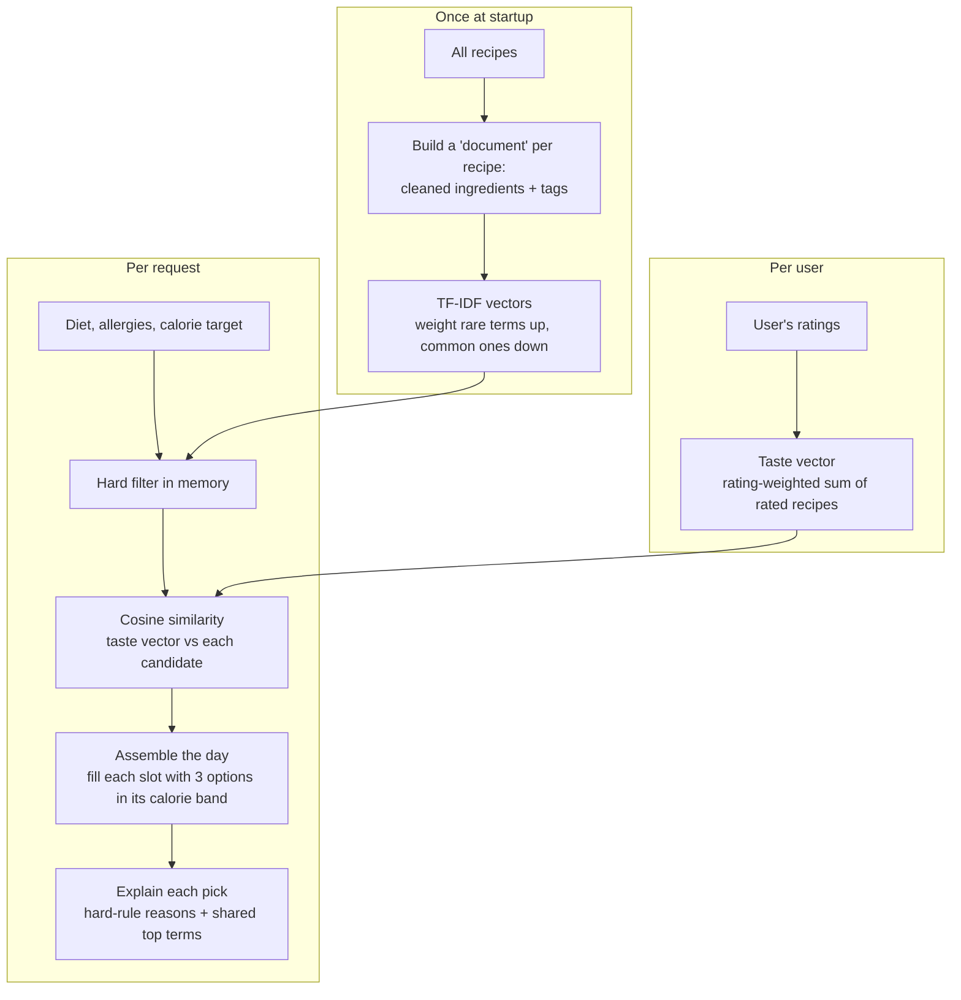

# Recommendation Logic (the ML)

The method is a content-based recommendation with **TF-IDF and cosine similarity**, personalised from the user's ratings.

## The whole idea, once

Every recipe gets turned into a vector describing what it's *made of* — its ingredients and tags. The user gets a vector too, built from the recipes they've rated well. Recommending is just finding the recipes whose vectors point the same way as the user's — measured by cosine similarity. And before any scoring happens, anything that breaks a hard rule (wrong diet, has an allergy, way off on cal) is thrown out, so the model only ever ranks food that's already safe to eat.

Here's the pipeline end to end:

## Why this

TF-IDF + cosine is the sweet spot: a standard, well-understood technique that works from the very first rating and reads the actual ingredients — so it can tell you like garlicky, tomato-heavy food even across different cuisines.

## Turning a recipe into numbers

**Step 1 — a document per recipe.** Glue together its cleaned ingredient words and its tags. A pasta dish becomes something like `tomato garlic basil olive-oil pasta parmesan italian main-course vegetarian`. Cleaning means dropping quantities and units — "2 tbsp butter, melted" becomes just `butter` — and lowercasing, so the same ingredient always looks the same.

**Step 2 — TF-IDF weights the words.** Not every word deserves equal say. TF-IDF gives each term a weight from two parts: how often it shows up in *this* recipe (term frequency), times how rare it is across *all* recipes (inverse document frequency). "Salt" is everywhere, so its IDF is near zero and it barely counts. "Saffron" is rare, so it counts a lot. The result: each recipe is a vector where the standout numbers are the ingredients that actually make it what it is. This is fit once over the whole corpus at startup.

## Learning a person's taste

**Step 3 — the taste vector.** Take the recipes the user has rated and sum their vectors, weighted by the rating. Centre the rating at 3 (on the 1–5 scale), so a 5★ pulls with +2, a 4★ with +1, a 2★ pushes back with −1, a 1★ with −2; a 3★ sits at zero and drops out. Add them up and you get one vector leaning toward the things they like and away from the things they don't. It's a sum, not an average, but since cosine similarity ignores length the two would rank identically.

Before the first rating there's no taste vector, so instead of guessing randomly the app just orders the filtered candidates by the dataset's own rating — a sensible, popular-first list. The instant they rate one dish, the taste vector takes over.

## Picking and arranging

**Step 4 — filter first.** The recipes aren't in the database. They're loaded from a JSON file at startup into in-memory arrays, and Postgres only holds user data — accounts, preferences, ratings, favourites. Filtering cuts the pool to recipes that match the diet, contain none of the user's allergens, sit in the slot's calorie band (60–140% of the slot target), and weren't rated 1★ or 2★ by this user. A disliked recipe is excluded outright, not just pushed down the ranking. This keeps the model from ever ranking something unsafe, and shrinks the work.

Diet is decided from ingredients, not the dataset's diet tags. Those tags can't be trusted to certify a dish as vegetarian, so meat and fish are detected by keyword-matching the ingredient text and title, backed by the dataset's meat/fish category tags — but the tags only ever push a recipe *out*, never mark one as safe. It's better to drop a borderline dish than to serve meat to a vegetarian. This is keyword-based and has a known long tail; a production system would use a trained classifier.

**Step 5 — score by cosine similarity.** For each survivor, take the cosine of the angle between the user's taste vector and the recipe's vector. 1 means same direction (very similar), 0 means unrelated. Cosine looks at *direction, not length*, which is exactly right — we care that a recipe is made of similar stuff, not that it lists more words. Rank by this.

**Step 6 — build a day, not a pile.** Split the calorie target across slots (breakfast 25%, lunch 35%, dinner 30%, snack 10%). For each slot, take the best eligible recipes inside that slot's calorie band — three options per slot, so the user chooses. If nothing lands in the band, fall back to the eligible recipes with the closest calories. A recipe already used earlier in the day won't be offered again. It's a greedy fill: no second pass, no backtracking.

Protein counts, but softly. Within a slot's calorie band, recipes are ranked on a blend of taste similarity and how well their protein meets that slot's share of the daily protein goal — both normalised to 0–1, protein weighted at 0.4. Taste still leads, but a higher-protein option wins when the taste scores are close, and protein fit stops helping once a recipe meets the target (so the day leans protein-adequate, not protein-maximal). Protein never overrides the calorie band or the diet and allergy filters — it only reorders what's already eligible.

**Step 7 — say why.** The reason falls right out of the method. Combine the hard-rule facts ("fits your lunch calories (~687 cal); 24 g protein") with the taste part — the top three terms this recipe shares with the ones the user rated highly ("shares feta, tomato and basil with dishes you rated well"). The explanation states calories and protein, not the diet type. Before the first rating there's no taste half, so it's replaced by a plain "a popular pick to start — rate it to personalise." That sentence is the actual reasoning.

## What changes as you use it

Every new rating nudges the taste vector, so the next plan drifts toward what the person is enjoying. Rate Italian dishes well and Italian-leaning recipes climb — the "more Italian next time" behaviour is just the taste vector moving toward those terms.

## The concepts underneath

Four things hold this up, and they're all derivable by hand:
- **TF-IDF** — term frequency times inverse document frequency, and why IDF buries common words and lifts rare ones.
- **Cosine similarity** — the cosine of the angle between two vectors, why it measures direction not size, and why that's what we want here.
- **The taste vector** — why centring the rating at 3 turns a like into a pull and a dislike into a push.