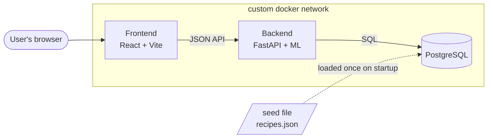
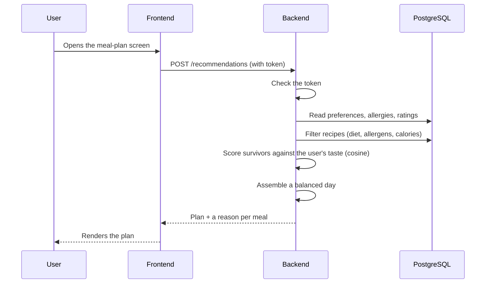
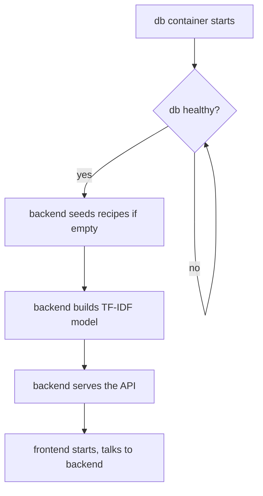

# System Architecture

The app is three containers that each do one job, wired together on a private Docker network and brought up with a single `docker compose up`.

- **Frontend** — a React (Vite) single-page app. Everything the user sees and clicks; it just calls the API and renders what comes back.
- **Backend** — a FastAPI service in Python. This is where the actual work happens: accounts, reading and writing data, and the recommendation engine. Including the machine learning part.
- **Database** — PostgreSQL. Holds the recipes loaded from the dataset, and everything about each user — preferences, ratings, saved meals, plans, shopping list.

They share a custom network so they can reach each other by name (`backend` talks to `db`, `frontend` talks to `backend`) without opening anything to the outside world that shouldn't be open.

## Following one request

## Where ML sits

All of it is inside the backend. When the backend boots, it reads the recipes out of the database once and builds their TF-IDF vectors in memory. After that, every recommendation reuses that in-memory model — no separate service, nothing on the frontend. Filter in the database, score with the model, assemble, respond.

## Getting data in

The recipe file ships inside the repo. On first boot the backend loads it into Postgres, but only if the recipes table is empty — so restarting doesn't pile up duplicates. That's what makes it plug-and-play: no manual import, no download at runtime.

## Startup order

This can't be left to chance, so it's enforced:

## The data itself

**Epicurious – Recipes with Rating and Nutrition** (Kaggle: `hugodarwood/epirecipes`), roughly 20k recipes. The `full_format_recipes.json` gives us, per recipe: title, ingredient lines, directions, category tags (diet, cuisine, course), and nutrition (calories, protein, fat, sodium). It's committed under `seed/` and declared in the README. One file feeds both sides of the app — the ingredients and tags become the recommendation vectors, and calories and protein drive the filtering.