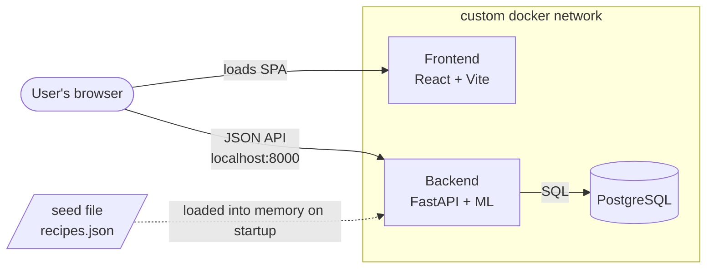
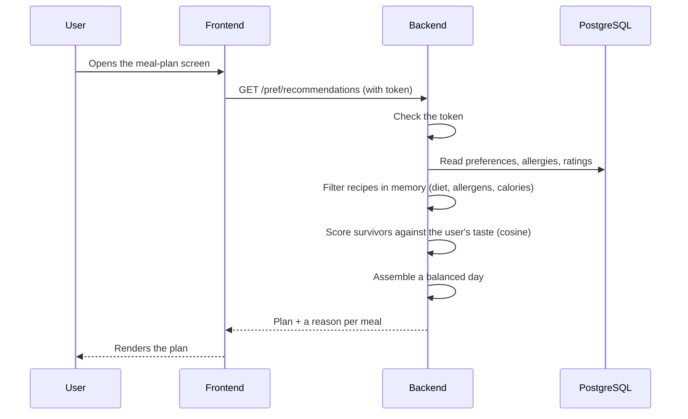
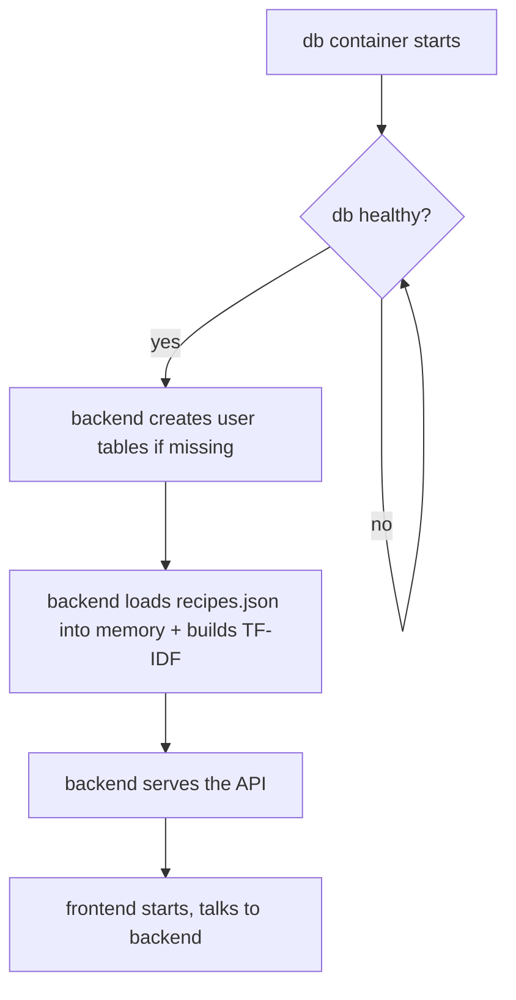

# System Architecture

The app is three containers that each do one job, wired together on a private Docker network and brought up with a single `docker compose up`.

- **Frontend** — a React (Vite) single-page app. Everything the user sees and clicks; it just calls the API and renders what comes back.
- **Backend** — a FastAPI service in Python. This is where the actual work happens: accounts, reading and writing data, and the recommendation engine. Including the machine learning part.
- **Database** — PostgreSQL. Holds everything about each user — accounts, preferences, allergies, ratings, saved meals. Not the recipes: those live in the backend's memory (see below).

They share a custom network so the backend can reach the database by name. The browser loads the SPA from the frontend and calls the backend directly on its published port (`localhost:8000`); CORS allows the frontend's origin.

## Following one request

## Where ML sits

All of it is inside the backend. When the backend boots, it reads the recipes from the JSON seed file once and builds their TF-IDF vectors in memory. After that, every recommendation reuses that in-memory model — no separate service, nothing on the frontend. Filter in memory, score with the model, assemble, respond.

## Getting data in

The recipe file ships in the repo and is mounted into the backend container (`./seed:/seed`). The backend reads it into memory every time it starts and builds the model — nothing is imported into Postgres, and there's no recipes table. That's what makes it plug-and-play: no manual import, no download at runtime. The tradeoff is that every boot re-parses and re-vectorises the dataset.

## Startup order

This can't be left to chance, so it's enforced:

## The data itself

**Epicurious – Recipes with Rating and Nutrition** (Kaggle: `hugodarwood/epirecipes`), roughly 20k recipes. The `full_format_recipes.json` gives us, per recipe: title, ingredient lines, directions, category tags (diet, cuisine, course), and nutrition (calories, protein, fat, sodium). It's committed under `seed/archive/` and mounted into the backend. One file feeds both sides of the engine — the ingredients and tags become the recommendation vectors, and calories and protein drive the filtering.
